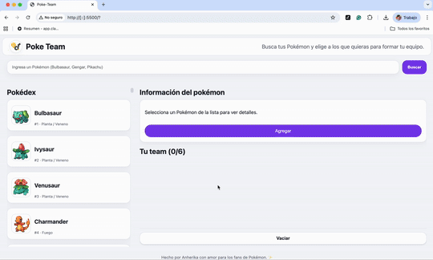

# Poke Team ✨  
_Busca, elige y arma tu team Pokémon (Kanto) directo en el navegador._

> (**Disclaimer**) Proyecto de **fans para fans**. No hay fines de lucro; no soy dueña de Pokémon ni de sus assets. Créditos a **The Pokémon Company**, **Game Freak**, **Nintendo** y a **PokeAPI** por datos y sprites. (´• ω •`) ♡

## Demo / Preview
- **Live** • https://anherika.github.io/poke-team/	
- **Screenshots-Demo:**  
  
  
---

## ¿Qué hace esta app?
- 🔎 **Búsqueda** por nombre/tipo.
- 🧾 **Pokédex Kanto (151)** con sprites animados (GIF) + fallback a PNG.
- 🧠 **Detalle** del Pokémon (número + tipos con chips de color).
- 🧑‍🤝‍🧑 **Equipo de 6** (sí, **6/6**): agregas desde el detalle y quitas con una ❌.
- 📦 **Persistencia** con `localStorage`.
- 🧭 **Estados**:
  - En la lista, los añadidos quedan **deshabilitados** con “✓ En tu equipo”.
  - El botón **Agregar** cambia: “Ya está en tu equipo”, “Equipo completo”, etc.
- 📱 **Responsive**:
  - En mobile, la Pokédex se compacta (scroll interno) y no tapa el detalle.
  - Botón **“Vaciar / Empezar de nuevo”** **sticky** al fondo del panel.
- 🧼 **"Accesible"**: `aria-live` para mensajes y colores legibles uwu (perdón por tan poco).
- ✨ **"Nuevos mensajes"** `SweetAlert2` para reemplazar alert, prompt y confirm por modales bonitos y personalizables.

---

## Stack
- **HTML + CSS + JS vanilla** (sin frameworks).
- **PokeAPI** para completar Kanto y traer sprites (GIF Gen V).
- **LocalStorage** para persistir el team.
- **Modales de SweetAlert2** Esto NUEVO!!!!! * - *

---

## Cómo usar
1. Busca o navega la Pokédex.
2. **Click** en una card para ver detalle.
3. **Agregar** desde el panel derecho (máximo **6**).
4. Quita del team con la **❌**.
5. Al llegar a **6/6**, verás “¡Tu equipo está listo!” y puedes **Empezar de nuevo**.

> Si un Pokémon ya está en tu team, su card se ve **gris** y con “✓ En tu equipo”.

---

## Estructura

## 📂 Estructura del proyecto
```
.
├─ index.html
├─ style/
│  └─ style.css
├─ js/
│  ├─ app.js
│  └─ data/
│     └─ pokedex.js
└─ assets/ 
```

---

---

## Correr local
**VS Code + Live Server**   
o en consola:

```bash
npx serve .
# o
npx http-server -c-1 .
```

---

## Updates de la version

✅ DOM + Eventos
	•	✅ Storage (localStorage)
	•	✅ Nuevos notificaciones (libreria nueva)
	•	✅ Funciones, arrays, objetos
	•	✅ HTML/CSS/JS separados y referenciados

---

## 📜 Créditos

	•	PokeAPI: https://pokeapi.co/
	•	Todos los derechos de las imagenes son de Pokémon © Nintendo, Game Freak, The Pokémon Company.
	•	Proyecto fanmade y no comercial.
	•	Hecho con cariño por Angelica Tenorio (Anherika) ✨  

Entrega final de curso de Javascript para CoderHouse.
